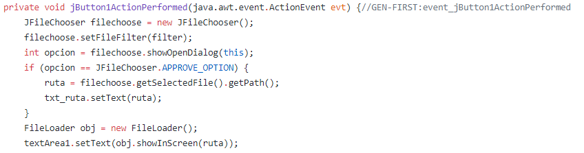
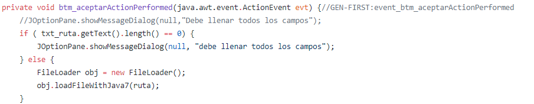
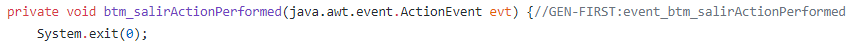
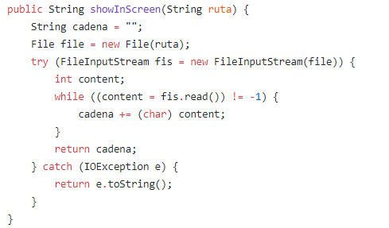
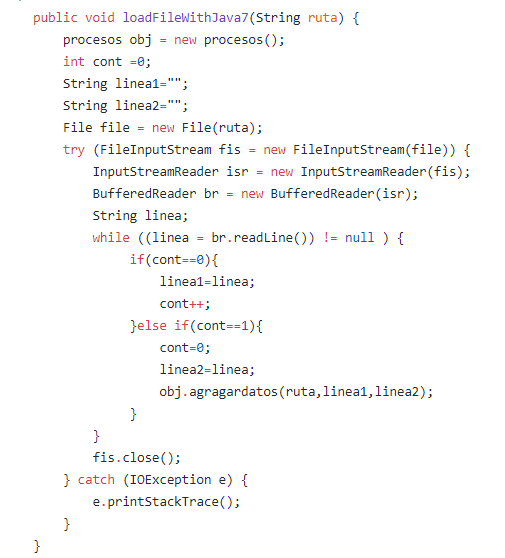
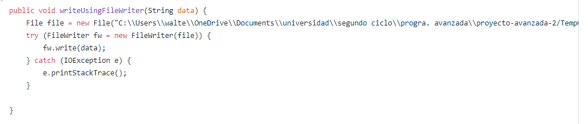
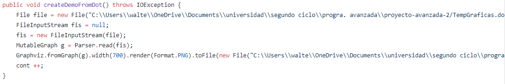

# Proyecto Avanzada 2
 
## Carlos Andrés Cuéllar Velásquez 2491117
## Walter Alexander Osoy Veliz 1126017

# -------------------Bitacora-------------------

### 1. Class Principal.

   1.1 Se crea el objeto que hace posible la exploracion de archivos, muestra el contenido del archivo seleccionado en el text area.
   
   
   
   1.2 Hace la validación que todos los campos esten llenos antes de comenzar a graficar.
   
   
   
   1.3 Cierra la aplicación.
   
   
  
### 2. Class FileLoader.

   2.1 parametro: ruta direccion del archivo a leer y returna: un cadena con el archivo completo para mostrarlo en un text area.
   
   
   
   2.2 Lee cada dos lineas para poder saber el tipo de estrutura y los datos a conformala, parametriza: ruta direccion del archivo a leer.
   
   
   
   2.3 recibe un cadena de texto que luegue escribe dentro de un archivo llamado TempGraficas.dot que hace posible la grafica de la      estructura, parametriza: datos a escribir.
   
   

### 3. Class Procesos.

   3.1 parametro: ruta direccion del archivo a leer y returna: un cadena con el archivo completo para mostrarlo en un text area.
   
   
   
   3.2 Lee cada dos lineas para poder saber el tipo de estrutura y los datos a conformala, parametriza: ruta direccion del archivo a leer.
   
   
   
   3.3 recibe un cadena de texto que luegue escribe dentro de un archivo llamado TempGraficas.dot que hace posible la grafica de la      estructura, parametriza: datos a escribir.
   
   

### 4. Class DemoGraphviz .

   4.1 Grafica el formato TempGraficas.dot que fue previamente modificado segun la estructura deseada.
   
   
   
   
